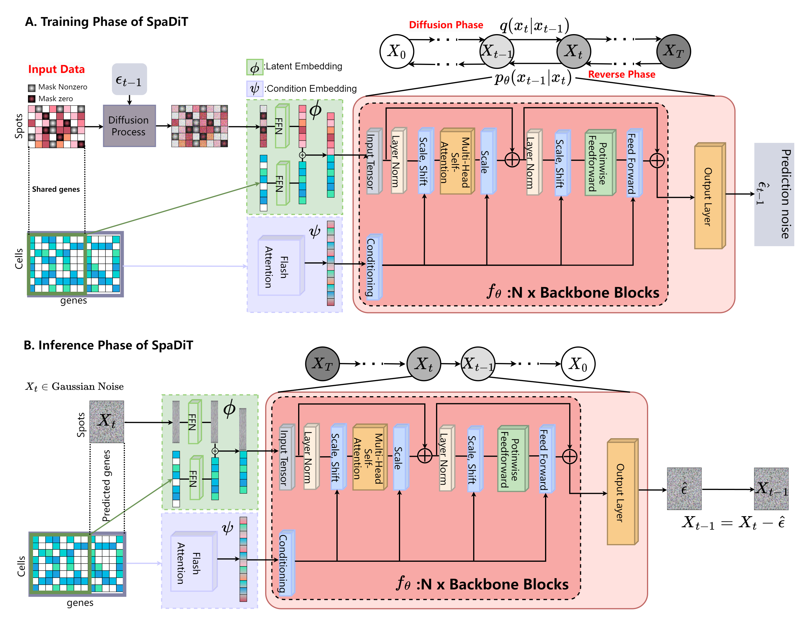

# SpaDiT: Diffusion Transformer for Spatial Gene Expression Prediction using scRNA-seq

A novel deep learning method that uses a diffusion generative model to integrate scRNA-seq data and
ST data for the prediction of undetected genes

## Overview of SpaDiT



## Setup

```
pip install -r requirement.txt
```
## Data
All the datasets used in this paper can be downloaded from url：https://zenodo.org/records/12792074

## Preprocess data

To preprocess the data, run the `data_preprocess.py` script located in the `preprocess` directory. Use the following command:

```
python preprocess/data_preprocess.py --input data/raw_data.csv --output data/processed_data.csv
```

## Running Experiments

To train the neural network, use the following command:

```
python main.py --config config/train_config.json
```

To evaluate the model, run:

```
python evaluate.py --model_path models/best_model.pth --data_path data/test_data

```


## Contact details

If you have any questions, please contact lixiaoyu@mail.ynu.edu.cn and wenwen.min@qq.com


## Citing
<table class="docutils footnote" frame="void" id="id2" rules="none">
<colgroup><col class="label" /><col /></colgroup>
<tbody valign="top">
<tr><td class="label"><a class="fn-backref" href="#id2">[1]</a></td><td> 
Xiaoyu Li, Fangfang Zhu, and Wenwen Min. "SpaDiT: Diffusion Transformer for Spatial Gene Expression Prediction using scRNA-seq." Briefings in Bioinformatics (2024).
</td></tr>
</tbody>
</table>

<p>The corresponding BiBTeX citation are given below:</p>
<div class="highlight-none"><div class="highlight"><pre>
@article{spadit,
  title={SpaDiT: diffusion transformer for spatial gene expression prediction using scRNA-seq},
  author={Li, Xiaoyu and Zhu, Fangfang and Min, Wenwen},
  journal={Briefings in Bioinformatics},
  volume={25},
  number={6},
  pages={bbae571},
  year={2024},
  publisher={Oxford University Press}
}
</pre></div>
